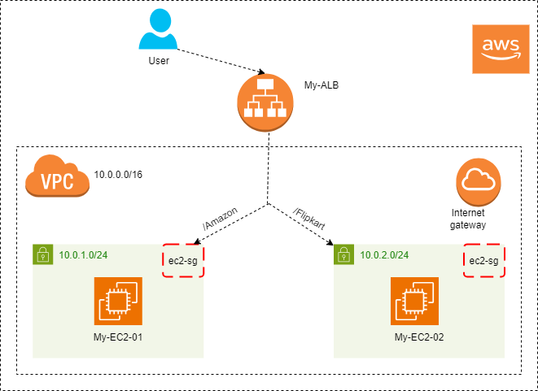
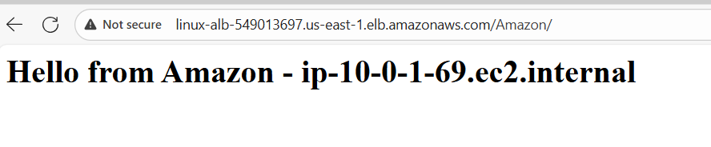
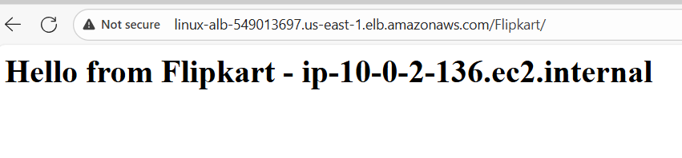

# 🚀 Terraform AWS — Application Load Balancer with Path-Based Routing (Amazon / Flipkart)

This Terraform project provisions the following AWS infrastructure:

* **VPC** with public networking  
* **Two public subnets** in different Availability Zones  
* **Internet Gateway** and **route table** for outbound internet access  
* **Security groups** for both EC2 and ALB  
* **Two Amazon Linux EC2 instances** (Amazon & Flipkart web apps)  
* **Application Load Balancer (ALB)** with **path-based routing**  
  * `/Amazon` → Amazon EC2 target group  
  * `/Flipkart` → Flipkart EC2 target group  

---

## 🏗️ Architecture Diagram


---

## 📂 Project Structure
.
├── main.tf # Main Terraform configuration
├── variables.tf # Input variables definition
├── terraform.tfvars # Variable values (environment-specific)
└── README.md # Documentation


---

## ⚙️ Prerequisites

Before running this configuration, ensure you have:

* **Terraform >= 1.3.0**  
* **AWS CLI** configured with valid credentials  
* **An AWS account** with permissions to create:
  * VPC, Subnets, Internet Gateway, Route Tables  
  * Security Groups  
  * EC2 Instances  
  * Application Load Balancer & Target Groups  

---

## 🔧 How It Works

1. **Creates VPC and Public Subnets** — for ALB and EC2 access.  
2. **Configures Internet Gateway and Route Table** — allows internet traffic.  
3. **Creates Security Groups**:  
   - `alb-sg`: Allows HTTP (80) inbound.  
   - `ec2-sg`: Allows SSH (22) & HTTP (80).  
4. **Launches EC2 Instances**:  
   - **Amazon EC2** → serves `/Amazon` page  
   - **Flipkart EC2** → serves `/Flipkart` page  
5. **Creates Application Load Balancer** spanning both subnets.  
6. **Defines Two Target Groups** — one for each EC2 app.  
7. **Creates ALB Listener Rule** for **path-based routing**:  
   - `/Amazon` → forwards to **Amazon TG**  
   - `/Flipkart` → forwards to **Flipkart TG**  

---

## 🧩 Example HTML Content (from EC2 user_data)

Each instance serves a unique web page:
```bash
echo "<h1>Welcome to Amazon Application - $(hostname -f)</h1>" > /var/www/html/index.html
echo "<h1>Welcome to Flipkart Application - $(hostname -f)</h1>" > /var/www/html/index.html
```

| Variable        | Description               | Type        | Example                                |
| --------------- | ------------------------- | ----------- | -------------------------------------- |
| `region`        | AWS region                | string      | `"us-east-1"`                          |
| `vpc_name`      | Name of the VPC           | string      | `"path-routing-vpc"`                   |
| `vpc_cidr`      | CIDR block for VPC        | string      | `"10.0.0.0/16"`                        |
| `subnets`       | Map of subnet definitions | map(object) | `{ subnet1 = {...}, subnet2 = {...} }` |
| `ami`           | Amazon Linux AMI ID       | string      | `"ami-0c02fb55956c7d316"`              |
| `instance_type` | EC2 instance size         | string      | `"t2.micro"`                           |

## 🪜 Deployment Steps

### 1️⃣ Initialize Terraform

```bash
terraform init
```

### 2️⃣ Validate Configuration

```bash
terraform validate
```

### 3️⃣ Plan Deployment

```bash
terraform plan
```

### 4️⃣ Apply Configuration

```bash
terraform apply -auto-approve
```

🌐 Test the Setup

After Terraform apply, you’ll see an output:

Outputs:

alb_dns_name = "path-routing-alb-1234567890.us-east-1.elb.amazonaws.com"


Now test both URLs:

http://${alb-name}-1234567890.us-east-1.elb.amazonaws.com/Amazon

http://${alb-name}-1234567890.us-east-1.elb.amazonaws.com/Flipkart

✅ You should see different web pages served from two EC2 instances!



🧹 Cleanup

To destroy all created AWS resources:
```
terraform destroy -auto-approve
```

📘 Notes

ALB supports path-based and host-based routing — this project uses path-based.

Requires at least two public subnets in different AZs for the ALB.

You can easily extend this setup for Blue/Green deployments or weighted routing.