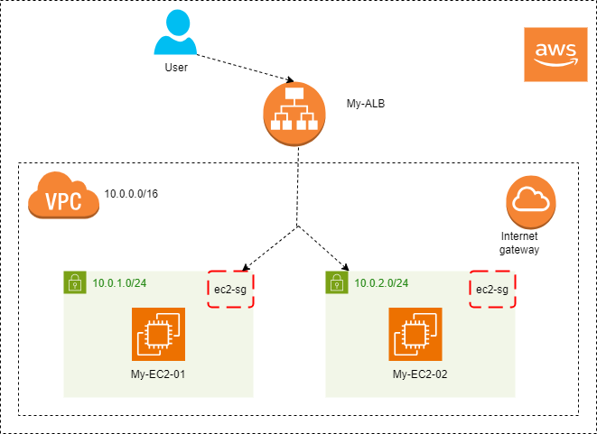

# 🚀 Terraform AWS — Application Load Balancer with EC2 Instances

This Terraform project provisions the following AWS infrastructure:

* **VPC** with public networking
* **Two public subnets** in different Availability Zones
* **Internet Gateway** and **route table** for outbound internet access
* **Security groups** for both EC2 and ALB using dynamic maps
* **Two Amazon Linux EC2 instances** running Apache web servers
* **Application Load Balancer (ALB)** forwarding HTTP traffic to EC2 instances
* **Target group** and listener for load balancing HTTP requests

## 🏗️ Architecture Diagram


## 📂 Project Structure

```
.
├── main.tf              # Main Terraform configuration
├── variables.tf         # Input variables definition
├── terraform.tfvars     # Variable values (environment-specific)
└── README.md            # Documentation
```

---

## ⚙️ Prerequisites

Before running this configuration, make sure you have:

* **Terraform >= 1.3.0**
* **AWS CLI** configured with valid credentials
* An active **AWS account**
* Appropriate IAM permissions to create:

  * VPC, Subnets, Route Tables, Internet Gateway
  * Security Groups
  * EC2 Instances
  * Load Balancer and Target Groups

---

## 🔧 How It Works

1. **Creates VPC** — A new isolated network with DNS support.
2. **Defines Subnets** — Two public subnets across different AZs (for ALB).
3. **Configures Internet Gateway and Routes** — To allow public internet access.
4. **Creates Security Groups** —

   * **ec2-sg**: Allows SSH (22) and HTTP (80).
   * **alb-sg**: Allows inbound HTTP (80).
5. **Launches Two EC2 Instances** — With Apache installed and a custom HTML page.
6. **Creates an Application Load Balancer (ALB)** — Spans both subnets, routes traffic to EC2s.
7. **Attaches Target Group and Listener** — For port 80 forwarding.

---

## 🧩 Variables Overview

| Variable          | Description                          | Type        | Example                                |
| ----------------- | ------------------------------------ | ----------- | -------------------------------------- |
| `region`          | AWS region                           | string      | `"us-east-1"`                          |
| `vpc_name`        | Name of the VPC                      | string      | `"linux-vpc"`                          |
| `vpc_cidr`        | CIDR block for VPC                   | string      | `"10.0.0.0/16"`                        |
| `subnets`         | Map of subnet definitions            | map(object) | `{ subnet1 = {...}, subnet2 = {...} }` |
| `security_groups` | Map of security group configurations | map(object) | `{ ec2 = {...}, alb = {...} }`         |
| `ami`             | Amazon Linux AMI ID                  | string      | `"ami-0c02fb55956c7d316"`              |
| `ec2_instances`   | Map of EC2 instance definitions      | map(object) | `{ ec2-1 = {...}, ec2-2 = {...} }`     |

---

## 🪜 Deployment Steps

### 1️⃣ Initialize Terraform

```bash
terraform init
```

### 2️⃣ Validate Configuration

```bash
terraform validate
```

### 3️⃣ Plan Deployment

```bash
terraform plan
```

### 4️⃣ Apply Configuration

```bash
terraform apply -auto-approve
```

### 5️⃣ Access the Web App

Once applied, Terraform will output the **ALB DNS name**:

```bash
Outputs:

alb_dns_name = "linux-alb-1234567890.us-east-1.elb.amazonaws.com"
```

Open the URL in your browser:

```
http://linux-alb-1234567890.us-east-1.elb.amazonaws.com
```

You should see:

```
Hello from Terraform Linux Apache! <hostname>
```

---

## 🧹 Cleanup

To remove all created AWS resources:

```bash
terraform destroy -auto-approve
```

---

## 📘 Notes

* Ensure the selected region (`us-east-1`) supports two AZs (e.g., `us-east-1a`, `us-east-1b`).
* You can modify `terraform.tfvars` to change instance types, subnet CIDRs, or security rules.
* The ALB requires **at least two subnets in different AZs** — already handled in this setup.

---

